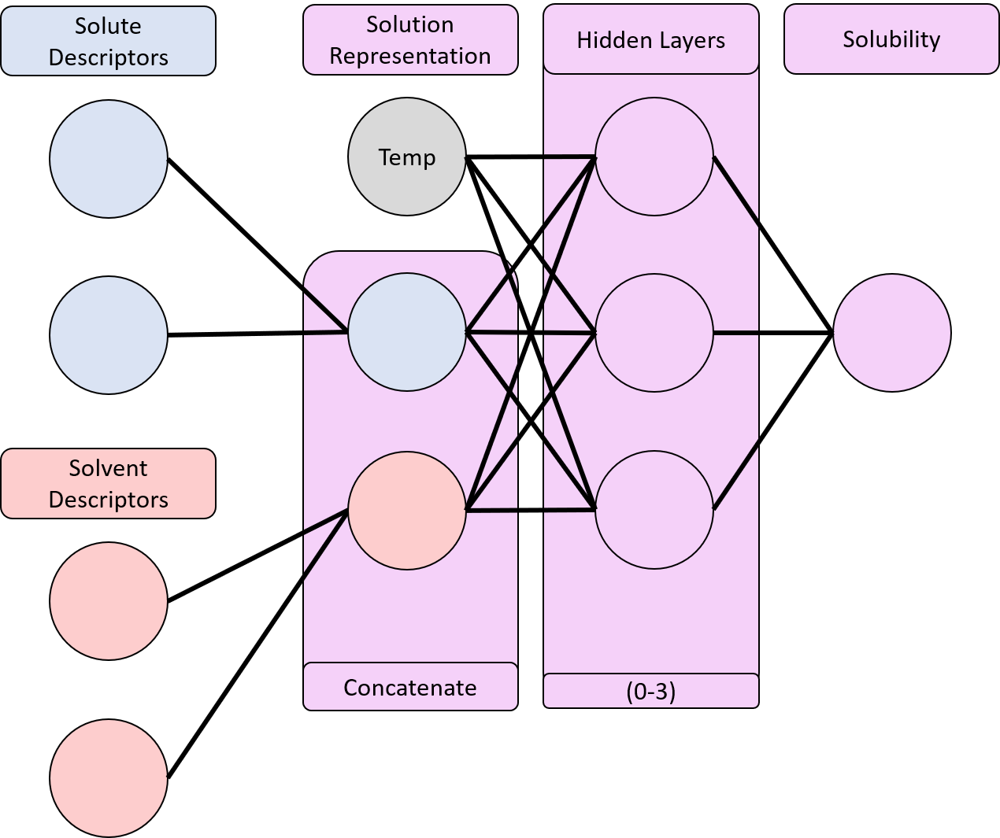
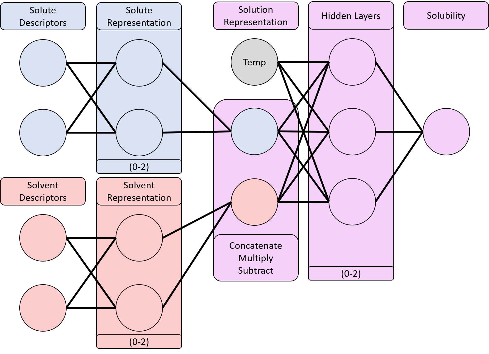

# Introduction
The solubilities of drug-like molecules in non-aqueous organic solvents are crucial properties for drug substance and drug product manufacturing. [@hewitt2009silico]
Experimentally measuring non-aqueous solid solubility requires notoriously tedious experiments which are both time-consuming and resource-intensive. [@alsenz2007high]
Thus, predicting organic solubility of drug-like molecules _a-priori_ based on their structure alone has been an active and robust area of academic and industrial research within the broader Quantitative Structure-Property Relationship (QSPR) domain. [@jorgensen2002prediction]

The traditional approach relies on empirical solubility models like the Abraham Solvation model [@taft1985linear], which fits multiplicative solvent and solute coefficients to a given dataset which are then added to predict the solubility.
These empirical approaches are incapable of extrapolation by their nature, limited by the experimental data from which they are derived.
Recent work has instead explored applying molecular Machine Learning (ML) to this problem, which in theory could learn the underlying physics dictating the solubility and thus generalize to new solutes, solvents, and temperatures. [@lusci2013deep; @panapitiya2022evaluation]

## Related Work
Previous studies have employed deep neural networks (NNs) learning from molecular fingerprints [@zang2017silico] or molecular descriptors[@boobier2020machine; @tayyebi2023prediction] as well as graph convolutional NNs (GCNNs) [@chemprop_theory].
Most similar to this study is the work of Panapitiya et al. which also uses molecular descriptors and a Multi-Layer Perceptron (MLP), though with a different feature set and network layout. [@panapitiya2022mdm]
For a more complete review of the current landspace, see Llompart et al. [@llompart2024solubilityreview]

Seeing the difficulty in directly mapping structures to solubility, recent studies have attempted to integrate the physics of solvation into the modeling approach.
For example, previous efforts by Vermeire et al. [@vermeire_solublility] combined three Directed-Message Passing NNs (D-MPNN) (via Chemprop [@chemprop_theory; @chemprop_software]) to predict different thermodynamic quantities which are combined to estimate solubility.
While this model demonstrates impressive performance in ultimately predicting solubility, the approach inherently leaks data since all solvent and solute molecules are seen during training; extrapolative data splitting would likely reveal worse model performance.
Another example is the work of Yashaswi and coauthors [@yashaswi_interaction], who used an 'interaction block' in their NN.
This intermediate layer performed a row-wise multiplication of the solute and solvent learned representations which was then passed to an MLP.
This is analogous to training the model to map the structures to abraham-like solubility parameters, which are then weighted and combined for prediction.

For the purpose of this study, we focus on extending the recently developed `fastprop` architecture, which has been demonstrated to outperform D-MPNN-based models in several molecular property prediction tasks using Mordred descriptors [@moriwaki2018mordred] with a deep MLP. [@fastprop]
Here, we hypothesized that incorporating physics of solvation into the interaction between solute and solvent interactions in a `fastprop`-based model could lead to further improved model performance. 

To this end, we present a physics-infused `fastprop` architecture which trains two separate MLP 'branches' to learn separate solute and solvent representations before combining the latent representations via a configurable interaction block.
We believe this is the first systematic comparison of different interaction architectures for the task of molecular organic solubility prediction.
This question of appropriately enforcing physics in our model is likely the most interesting and challenging aspect of this project.
Since it is difficult to compare model performance directly to Vermeire et al. due to the previously specified data leak, we compared our model performance against datasets compiled by Boobier et al., which directly predicts solubility of various solutes in ethanol, benzene, and acetone at arbitrary temperatures. [@boobier2020machine]

## Data
We use the aforementioned solubility dataset published by Vermeire et al. [@vermeire_solublility] which is made available in a machine-readable format on Zenodo (https://zenodo.org/records/5970538).
This dataset contains 6236 experimental solubility measurements (logS) with solute and solvent SMILES, as well as the temperature (K) of the experiment.
The units of solubility (S), are mol solute/liter solvent, which is log-transformed in base 10 to get logS.
The original collators performed extensive data curation so the reported solubility values are already well-sanitized and on a unified scale.
We apply standard scaling to the feature values to ensure that the features are normally distributed during training.

There are 99 unique solvents in the dataset, which is quite data-rich relative to other solubility datasets that often contain only single digit solvents, as in Boobier et al. (4 solvents). [@boobier2020machine]
There are 165 unique solutes in the dataset with the median number of measurements being 14.
Figure \ref{label_distribution} below shows the distribution of logS across the dataset which ranges from -8.8 to 2.0.

![Distribution of logS Values in Vermiere et al. [@vermeire_solublility]\label{label_distribution}](../figures/label_distribution.png){ width=3in }

The distribution is left-skewed with a unimodal peak near -1.
Although 6236 datapoints is a relatively small dataset in the context of machine learning, this dataset is among the largest open-access experimental solubility datasets in literature.

After training on the Vermeire dataset we also evaluated model performance on the Boobier dataset.
This allowed us to directly benchmark our model performance to a solubility prediction task, which was not possible with the Vermeire dataset, and evaluate the capacity to extrapolate to unseen solutes.
This comparison outside of the baseline study is unorthodox but important - the Vermeire dataset is superior for training due to its incredible diversity of solvents and temperature measurements, but a fair comparison of models requires training on the same task.

The Boobier dataset contains far more solutes but only benzene, acetone, and ethanol as solvents [^1].
This dataset contains a huge diversity in solutes: the benzene dataset contains 425 unique solutes, the acetone dataset contains 405, and the ethanol dataset contains 639. Removing the intersection between these datasets yields 1440 unique solutes in total.
The distribution of logS labels in each solvent in the Boobier dataset are also shown below. 

![Distribution of logS Values in Boobier et al. [@boobier2020machine]\label{boobier_label_distribution}](../figures/boobier_label_distribution.png){ width=3in }

[^1]: The referenced study did not include temperatures for all measurements.
The acetone dataset was reduced from 452 to 405, benzene from 464 to 425, and ethanol from 695 to 639 measurements.
None of the aqueous solubility measurements include temperature, so the subset was dropped in its entirety.

# Methods
The typical `fastprop` architecture maps a single molecule's molecular descriptors to its property via an MLP.
The most obvious approach to amend this to properties based on pairs of molecules would be to simply concatenate the two molecules' descriptor sets and pass the resulting vector to a larger MLP, also concatenating the temperature as an additional input.
This 'architecture' is shown in Figure \ref{unbranched_model}.

{ width=4in }

Molecule are represented using all of the Mordred descriptors, 1,613 each for the solvent and solute.
Later hyperparameter optimization with Optuna [@akiba2019optuna] will select the hidden layers sizes $\in {200, 5000}$ and depth $\in {0, 2}$ and the choice of activation function.

This baseline model is some arbitrary non-linear mapping between structures and solubility - essentially making _no_ assertions about the underlying physics.
To incorporate physics we perform a second hyperparameter optimization on the architecture shown in Figure \ref{branched_model}.

{ width=4in }

The two separate MLPs for the solute and solvent descriptors allow for the network to learn unique latent embeddings for the two molecules, whereas in the baseline model they would necessarily be combined.
This is done based on our physics understanding that a given solute or solvent has similar behavior across many combinations and thus one generally applicable embedding rather than infinitely many pair-specific embeddings.
The choice of interaction block also reflects the underlying functional form of solvation physics.
Row-wise multiplication is analogous to the aforementioned Abraham model whereas subtraction mimics a group additivity-style approach.
By allowing the hyperparameter optimization to choose the interaction operation, depth and height of branch and interactions MLPs, and activation function we can systematically explore most effective method of infusing physics. We refer to this model as 'fastsolv.'

Data is partitioned into training, validation, and testing based on a random split of the solutes.
This allows the model to see all solvents during training but only a subset of solutes, thus evaluating its capacity to extrapolate to unseen solute structures.
Solute extrapolation was chosen to reflect the expected application of this model.
More often we are interested in predicting solubility for a new solute in an existing solvent than vice versa.

Mean Absolute Error (MAE) and Root Mean Squared Error (RMSE) are both used as evaluation metrics accordings to their typical defintions.
Taking after Boobier et al. we also evaluate the percentage of predictions which are within 0.7 and 1.0 log units of the true value, thresholds which were determined in their study to consitute 'useful' models. 

**add training details: number of epochs, learning rate, early stopping/patience, optimizer (adam)
# Results
We first evaluate the performance of the baseline unbranched model, which concatenates the solute and solvent descriptors and feeds them to an MLP. We used the hyperparameters summarized in the table below. 

\begin{table}[]
\centering
\begin{tabular}{|c|c|}
\hline
Hidden layers          & 2    \\ \hline
Hidden layer dimension & 3000 \\ \hline
\end{tabular}
\end{table}

The baseline model performance on all four datasets are summarized below. We observe strong extrapolation within the Vermeire dataset, with nearly identical error on the validation ($\text{RMSE} = 0.73$) and solute hold-out test set ($\text{RMSE} = 0.71$). However, when extrapolating to the solutes in the Boobier dataset, we observe much worse performance, with $\text{RMSE} = 1.67$ for solubility in acetone, $\text{RMSE} = 1.55$ for solubility in benzene, and $\text{RMSE} = 1.45$ for solubility in ethanol. This poor performance is not surprising, given that the solute diversity (1440 unique solutes) in the Boobier presents a difficult extrapolatory task. 

*add table caption and label
\begin{table}[]
\begin{tabular}{|c|cc|ccc|}
\hline
                  & \multicolumn{2}{c|}{Vermeire}          & \multicolumn{3}{c|}{Boobier}                                          \\ \hline
Metric            & \multicolumn{1}{c|}{Validation} & Test & \multicolumn{1}{c|}{Acetone} & \multicolumn{1}{c|}{Benzene} & Ethanol \\ \hline
MAE               & \multicolumn{1}{c|}{0.61}       & 0.58 & \multicolumn{1}{c|}{1.53}    & \multicolumn{1}{c|}{1.40}    & 1.29    \\ \hline
RMSE              & \multicolumn{1}{c|}{0.73}       & 0.71 & \multicolumn{1}{c|}{1.67}    & \multicolumn{1}{c|}{1.55}    & 1.45    \\ \hline
\% logS $\pm$ 0.7 & \multicolumn{1}{c|}{0.65}       & 0.70 & \multicolumn{1}{c|}{0.24}    & \multicolumn{1}{c|}{0.27}    & 0.30    \\ \hline
\% logS $\pm$ 1.0 & \multicolumn{1}{c|}{0.82}       & 0.82 & \multicolumn{1}{c|}{0.34}    & \multicolumn{1}{c|}{0.39}    & 0.43    \\ \hline
\end{tabular}
\end{table}

We next performed hyperparameter optimization on fastsolv, identifying the optimal hyperparameters as shown in the table below:

\begin{table}[]
\begin{tabular}{|l|l|}
\hline
Solute branch hidden layers  & 3              \\ \hline
Solvent branch hidden layers & 3              \\ \hline
Branch layer dimension       & 1000           \\ \hline
Interaction layers           & 1              \\ \hline
Interaction layer dimension  & 400            \\ \hline
Interaction operation        & multiplication \\ \hline
\end{tabular}
\end{table}

The optimizied fastsolv model passes the descriptors of the solute and solvent through 3 hidden layers each, before multiplying the resulting learned representations, and passing the solution representation through another hidden layer in the interaction module. We next evaluated the optimized fastsolv model on the Vermeire and Boobier datasets. The results are summarized in the table below. 

\begin{table}[]
\begin{tabular}{|c|cc|ccc|}
\hline
                  & \multicolumn{2}{c|}{Vermeire}          & \multicolumn{3}{c|}{Boobier}                                          \\ \hline
Metric            & \multicolumn{1}{c|}{Validation} & Test & \multicolumn{1}{c|}{Acetone} & \multicolumn{1}{c|}{Benzene} & Ethanol \\ \hline
MAE               & \multicolumn{1}{c|}{0.56}       & 0.60 & \multicolumn{1}{c|}{0.68}    & \multicolumn{1}{c|}{0.77}    & 0.69    \\ \hline
RMSE              & \multicolumn{1}{c|}{0.68}       & 0.70 & \multicolumn{1}{c|}{0.83}    & \multicolumn{1}{c|}{0.92}    & 0.83    \\ \hline
\% logS $\pm$ 0.7 & \multicolumn{1}{c|}{0.68}       & 0.65 & \multicolumn{1}{c|}{0.60}    & \multicolumn{1}{c|}{0.50}    & 0.55    \\ \hline
\% logS $\pm$ 1.0 & \multicolumn{1}{c|}{0.84}       & 0.84 & \multicolumn{1}{c|}{0.78}    & \multicolumn{1}{c|}{0.69}    & 0.76    \\ \hline
\end{tabular}
\end{table}

We observe that the performance of fastsolv and the baseline model are very similar on the Vermeire dataset, with marginal improvements in fastsolv. For example, the test RMSE decreased from 0.71 for the baseline model to 0.68 for fastsolv. However, we observe massive performance gains when extrapolating to the Boobier dataset, with RMSE decreasing from 1.67, 1.55, and 1.45 for the baseline model to 0.83, 0.92, and 0.83 for fastsolve for the acetone, benzne, and ethanol test sets, respectively. 

We attribute this improved performance when extrapolating to new solute space to the ability for fastsolv to learn latent representations for the solute and solvent independently. Since solutes and solvents contribute differently solvation, allowing a model to learn different latent representations improves model performance. Additionally, the interaction operation selected by hyperparameter optimization is also informative as to which solvation physics may be closer to ground truth. The top 10 performing models (out of 32) tested during hyperparameter optimization all multiplied the latent representations of the solute and solvent to generate the solution representation. As previously suggested, multiplying these representations is analagous to a Abraham solvation model, which multiplies molecular descriptors of the solute and solvent to generate solubility predictions. While it is difficult to definitively attribute the improved performance solely to the physics-infusion of fastsolv, the increased accuracy does suggest that infusing physical intuition to model architecture is a viable route to more accurate molecular property prediction. 


<!-- Consider adding this section about highly soluble molecules back to the paper for submission to a journal - it could prove interesting as a comment on 'hit detection', an interesting application of these models.

## Highly Soluble Species
Story:
 - Vermeire devised a method to predict solubility of arbitrary combinations of molecules at any temperature.
 - Attia was using this for an actual system in research, it was supposed to be highly soluble, the model predicted a non-physical high value.
 - On further investigation, _approximately_ 90% of the data falls in the range of insoluble to 1/3 of the max, 10% in the range of 1/3rd most to 2/3rd most, and only 1% of the dataset is in the range of very high solubility the remaining 1/3rd of the solublity range
 - Ideas: apply power scaling to smooth this range, then train another chemprop model to see if it works; train a fastprop model on the whole data and this range for comparison.
 - Limitation - not interested in any other than STP, so retraining the model in the future will be required for fair comparison (unless we want to add temperature to fastprop, which is possible) after we use the published model just to check the accuracy on this limited range 

If we drop all datapoints where the solubility is less than 1 mol/L, performance changes dramatically.

For `fastprop`:
```
[03/12/2024 01:23:35 PM fastprop.fastprop_core] INFO: Displaying validation results:
                     count      mean       std       min       25%       50%       75%       max
validation_mse_loss    4.0  0.257756  0.094608  0.151753  0.192381  0.263613  0.328988  0.352045
validation_r2          4.0  0.714407  0.127950  0.599541  0.605701  0.715413  0.824119  0.827263
validation_mape        4.0  1.281281  0.630359  0.550676  0.859609  1.356428  1.778099  1.861591
validation_wmape       4.0  0.257741  0.067712  0.192016  0.215704  0.245380  0.287417  0.348188
validation_l1          4.0  0.116890  0.028396  0.081056  0.103550  0.119001  0.132341  0.148505
validation_mdae        4.0  0.083636  0.034056  0.043839  0.069830  0.081935  0.095741  0.126836
validation_rmse        4.0  0.166500  0.032278  0.130036  0.144165  0.169537  0.191872  0.196892
[03/12/2024 01:23:35 PM fastprop.fastprop_core] INFO: Displaying testing results:
               count      mean       std       min       25%       50%       75%       max
test_mse_loss    4.0  0.265054  0.066032  0.182714  0.227933  0.273366  0.310487  0.330772
test_r2          4.0  0.708471  0.075085  0.615578  0.668376  0.714235  0.754330  0.789837
test_mape        4.0  2.460535  1.070645  1.086656  1.975646  2.564792  3.049682  3.625901
test_wmape       4.0  0.250249  0.037491  0.195151  0.244520  0.263510  0.269238  0.278824
test_l1          4.0  0.116859  0.017160  0.091285  0.115636  0.124012  0.125235  0.128125
test_mdae        4.0  0.081192  0.018433  0.057189  0.072727  0.083629  0.092093  0.100319
test_rmse        4.0  0.170068  0.022425  0.142686  0.156965  0.172303  0.185406  0.192982
[03/12/2024 01:23:35 PM fastprop.fastprop_core] INFO: 2-sided T-test between validation and testing rmse yielded p value of p=0.862>0.05.
[03/12/2024 01:23:35 PM fastprop.cli.fastprop_cli] INFO: If you use fastprop in published work, please cite: ...WIP...
[03/12/2024 01:23:35 PM fastprop.cli.fastprop_cli] INFO: Total elapsed time: 0:01:48.665913
```

and for chemprop:
```
Moving model to cuda
Model 0 test rmse = 0.266730                                                                                                                                                                                                                                      
Model 0 test mae = 0.202236
Model 0 test r2 = 0.329536
Ensemble test rmse = 0.266730
Ensemble test mae = 0.202236
Ensemble test r2 = 0.329536
1-fold cross validation
        Seed 0 ==> test rmse = 0.266730
        Seed 0 ==> test mae = 0.202236
        Seed 0 ==> test r2 = 0.329536
Overall test rmse = 0.266730 +/- 0.000000
Overall test mae = 0.202236 +/- 0.000000
Overall test r2 = 0.329536 +/- 0.000000
Elapsed time = 0:00:49
```
-->

# Conclusion
Here, we explored descriptor-based models for molecular property prediciton of temperature-dependent solid solubulity, using Mordred descriptors as inputs to the model. We developed a physics-infused architecture, which learns latent representations of the solvent and solute molecular independently, then multiplies these learned representations to give a solution representation, which is passed through an MLP and reads out solubility. We compared the performance of a baseline descriptor model to the physics-infused model, fastsolv, on the solubility datasets compiled by Vermiere and Boobier. Both models interpolated and extrapolated into new solutes within the Vermiere dataset similarly well, but fastsolv dramatically improved extrapolation into the fast solute space of Boobier much more effectively. For a realistic drug discovery application, predicting solubility of an arbitrary solute is crucial. The ability of fastsolv to extrapolate to new solutes presents utility in such applications. Overall, this work presents the value of providing machine learning models with physical inductive bias in molecular machine learning tasks. 

<!-- These two sections can be removed after submitting the class report - they are likely not needed for a journal submission. -->
# Contributions
Burns and Attia both contributed to ideation, code development, and writing. 
# Code
Code is available via GitHub

<!-- These sections should be added back for the eventual paper submission.
# Declarations

## Availability of data and materials
All associated code for this paper can be accessed on GitHub at GitHub.com/JacksonBurns/highsol.

All data used are available to the public under a permissive license.
See the GitHub repository for more information on retrieving the data.

## Funding
This material is based upon work supported by the U.S. Department of Energy, Office of Science, Office of Advanced Scientific Computing Research, Department of Energy Computational Science Graduate Fellowship under Award Number DE-SC0023112.

## Acknowledgements
Yes, perhaps, indeed.

## Disclaimer
This report was prepared as an account of work sponsored by an agency of the United States Government.
Neither the United States Government nor any agency thereof, nor any of their employees, makes any warranty, express or implied, or assumes any legal liability or responsibility for the accuracy, completeness, or usefulness of any information, apparatus, product, or process disclosed, or represents that its use would not infringe privately owned rights.
Reference herein to any specific commercial product, process, or service by trade name, trademark, manufacturer, or otherwise does not necessarily constitute or imply its
endorsement, recommendation, or favoring by the United States Government or any agency
thereof.
The views and opinions of authors expressed herein do not necessarily state or reflect those of the United States Government or any agency thereof. -->

# Cited Works
